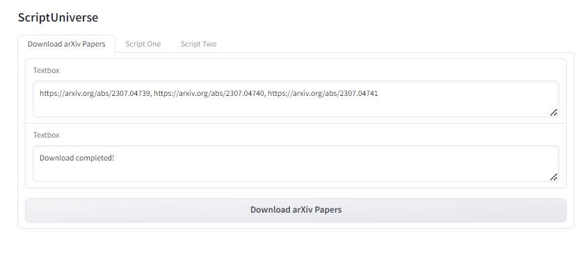

# ScriptUniverse

[English](README.md) | [简体中文](README_zh.md)

## Project Overview

**ScriptUniverse** is a project aimed at consolidating your everyday scripts and visualizing them through Gradio. Our goal is to provide an integrated platform that allows users to easily manage and run various scripts, thereby enhancing work efficiency and code maintainability.



## Features

### Current Features

- **Batch Download arXiv Papers**: Download papers in bulk to a local directory by inputting arXiv paper URLs.
  

### Future Plans

- **Integrate More Scripts**: Gradually add more commonly used scripts, such as data processing, machine learning model training, etc.

## Installation and Usage

### Installation

1. **Clone the Repository**:
   ```sh
   git clone https://github.com/JimmyPang02/ScriptUniverse.git
   cd ScriptUniverse
   ```

2. **Install Dependencies**

### Usage

1. **Run the Gradio App**:
   ```sh
   python gradio_scripy.py
   ```

2. **Access the Gradio Interface**:
   - Open your browser and visit `http://127.0.0.1:7860`.

3. **Download arXiv Papers**:
   - In the "Download arXiv Papers" tab, enter multiple arXiv paper URLs separated by commas.
   - Click the "Download arXiv Papers" button to start the download.

## Code Structure

- `gradio_scripy.py`: The main file for the Gradio app, defining the user interface and script invocation logic.
- `download_paper.py`: Contains the function for downloading arXiv papers.

## Contribution

We welcome any form of contribution, including but not limited to:

- **Code Submissions**: Fix bugs, add new features.
- **Documentation Improvements**: Enhance the README, add usage instructions.
- **Feedback and Suggestions**: Provide improvement suggestions or report issues.

## License

This project is licensed under the MIT License. For more information, see the [LICENSE](LICENSE) file.

## Contact Us

If you have any questions or suggestions, please contact us via [GitHub Issues](https://github.com/JimmyPang02/ScriptUniverse/issues).

---

Thank you for using ScriptUniverse! We look forward to your participation and contributions.