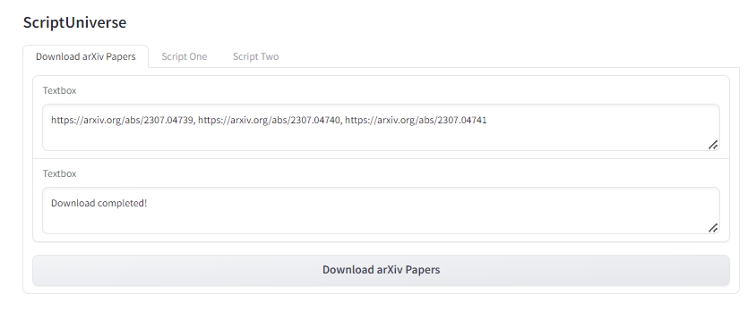
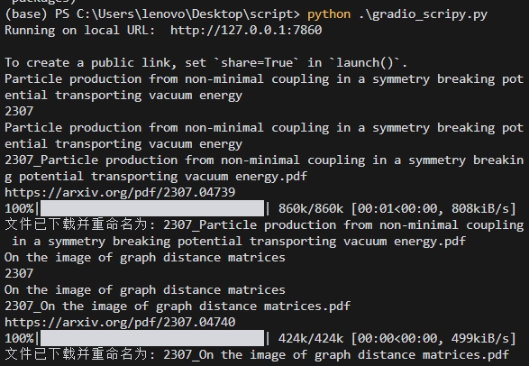

# ScriptUniverse
[English](README.md) | [简体中文](README_zh.md)

## 项目概述

**ScriptUniverse** 是一个旨在将你平时编写的脚本统一起来，并通过 Gradio 进行可视化展示的项目。我们的目标是提供一个集成的平台，让用户能够轻松管理和运行各种脚本，从而提高工作效率和代码的可维护性。


## 功能概述


### 当前功能

- **批量下载 arXiv 论文**：通过输入 arXiv 论文的 URL，批量下载论文到本地指定目录。


### 未来计划

- **集成更多脚本**：逐步添加更多常用脚本，如数据处理、机器学习模型训练等。


## 安装与使用

### 安装

1. **克隆仓库**：
   ```sh
   git clone https://github.com/JimmyPang02/ScriptUniverse.git
   cd ScriptUniverse
   ```

2. **安装依赖**


### 使用

1. **运行 Gradio 应用**：
   ```sh
   python gradio_scripy.py
   ```

2. **访问 Gradio 界面**：
   - 打开浏览器，访问 `http://127.0.0.1:7860`。

3. **下载 arXiv 论文**：
   - 在“下载 arXiv 论文”标签页中，输入多个 arXiv 论文的 URL，用逗号分隔。
   - 点击“下载 arXiv 论文”按钮，开始下载。

## 代码结构

- `gradio_scripy.py`：Gradio 应用的主文件，定义了用户界面和脚本调用逻辑。
- `download_paper.py`：包含下载 arXiv 论文的脚本函数。

## 贡献

我们欢迎任何形式的贡献，包括但不限于：

- **代码提交**：修复 bug、添加新功能。
- **文档改进**：完善 README、添加使用说明。
- **反馈建议**：提出改进建议或报告问题。

## 许可证

本项目采用 MIT 许可证。有关更多信息，请参阅 [LICENSE](LICENSE) 文件。

## 联系我们

如果你有任何问题或建议，请通过 [GitHub Issues](https://github.com/JimmyPang02/ScriptUniverse/issues) 联系我们。

---

感谢你使用 ScriptUniverse！我们期待你的参与和贡献。